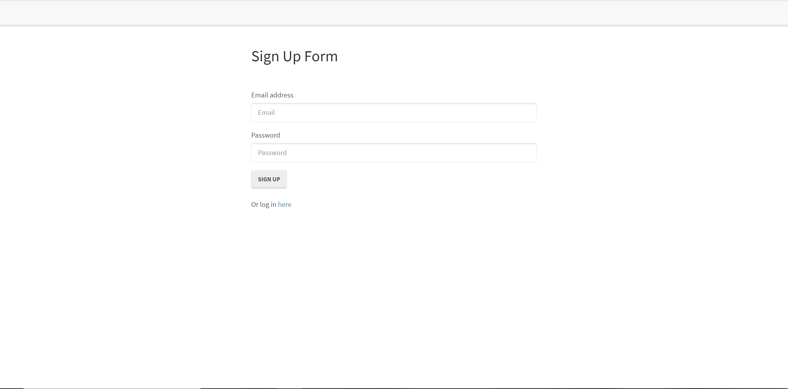

# Reverse Auth Passport

This application allows the user to create a unique login that includes and email address and password. The email and password are then saved and the user can log back into the application with their already saved credentials. When they are logged in, their email address is displayed and they see a nice welcome to their memebers page. This is all possible through the use of Passport.js that aloows the credentials to be stored and a unique string of characters assigned to the enter password to enure that they are matching.

## Screenshot of Application

## See a Video Explanation of the Application

* [Video Tutorial](https://www.youtube.com/watch?v=Q5xqHeseW0k)

## Built With
* [HTML](https://developer.mozilla.org/en-US/docs/Web/HTML)
* [CSS](https://developer.mozilla.org/en-US/docs/Web/CSS)
* [Javascript](https://developer.mozilla.org/en-US/docs/Web/JavaScript)
* [Node.js](https://nodejs.org/en/)
* [Express.js](http://expressjs.com/)
* [MySQL](https://www.mysql.com/)

## Author

* **Ryan Nemec** 

- [Link to Portfolio Site](https://perfectoment.github.io/Ryan-Portfolio/)
- [Link to Github](https://github.com/perfectoment)
- [Link to LinkedIn](https://www.linkedin.com/in/ryan-nemec-5a6b3a66/)